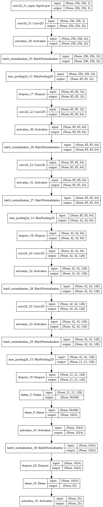

# Plant-Disease-Detection

This python code implements a model using VGGNet architecture of Convolutional Neural Network which was trained by a 
dataset of images in order to identify plant diseases.

The following picture provides a visual representation of the implemented model.

   

